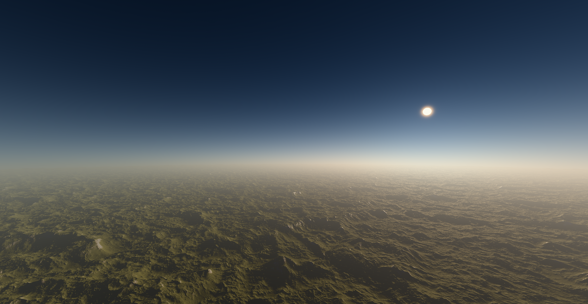

# Altitude-Responsive Sky Model

Altitude-responsive atmospheres for Godot 4, precomputed using the [Prague Sky Model](https://github.com/PetrVevoda/pragueskymodel).

## Features

- Written in C++ as a GDExtension add-on compatible with official builds of Godot Engine.
- Integrates the Prague Sky Model texture generator into Godot Engine.
- Produces physically plausible skies based on the observer's altitude.
- Supports configurable atmospheric and rendering parameters.
- Includes atmospheric fog and configurable atmosphere settings.
- Can be used together with the [Terrain3D](https://github.com/TokisanGames/Terrain3D) add-on.

## Getting Started

See [User Documentation](docs/UserDocumentation.md) for installation and usage instructions.

## Modifying the Add-on

See [Technical Documentation](docs/TechnicalDocumentation.md) for information about compiling the add-on and modifying its source code.

## More Information

This add-on was developed as part of a bachelor's thesis at Charles University in Prague in 2026.

## Credits

Developed for the Godot community by Ilia Riabko under the supervision of [Alexander Wilkie](https://cgg.mff.cuni.cz/members/wilkie/).

## License

This addon has been released under the [MIT License](LICENSE.txt).
